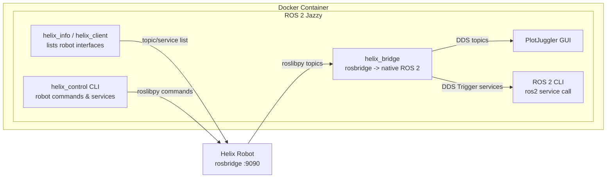

# Helix Interface Documentation

This folder documents the ROS 2 interfaces exposed by the Helix robot and
how to see them from inside this container - through the `helix_comm`
tools, the ROS 2 CLI and PlotJuggler.

## Table of Contents

- [Topics and Services](topics_and_services.md) - complete inventory of
  the robot's rosbridge topics and services, with types and descriptions
- [Where to Find Things](#where-to-find-things) - official references and
  local tools
- [How to View Topics and Services](#how-to-view-topics-and-services) -
  quick start for listing, echoing and plotting everything
- [Data Flow](#data-flow) - how the pieces connect

## Where to Find Things

### Official robot software (`eai-ag`)

The authoritative reference lives in the
[`ros-helix`](https://github.com/eai-ag/ros-helix) repository, which
implements the embedded ROS 2 system running on the robot:

- [`Topics_and_Services.md`](https://github.com/eai-ag/ros-helix/blob/main/Topics_and_Services.md) -
  the official topic and service reference, the basis of
  [topics_and_services.md](topics_and_services.md)
- [`Userguide_0_Configuration.md`](https://github.com/eai-ag/ros-helix/blob/main/Userguide_0_Configuration.md) -
  configuration files available to adjust system parameters
- [`Userguide_1_Calibration_And_Basic_Control.md`](https://github.com/eai-ag/ros-helix/blob/main/Userguide_1_Calibration_And_Basic_Control.md) -
  calibrating and controlling the arm and gripper tendons
- [`Userguide_2_Cartesian_Control.md`](https://github.com/eai-ag/ros-helix/blob/main/Userguide_2_Cartesian_Control.md) -
  cartesian control of the end effector
- [`Userguide_3_External_Interfaces.md`](https://github.com/eai-ag/ros-helix/blob/main/Userguide_3_External_Interfaces.md) -
  Foxglove, rosbridge and `roslibpy` usage
- [`helix_ros2_diagram.pdf`](https://github.com/eai-ag/ros-helix/blob/main/helix_ros2_diagram.pdf)
  ([`.drawio` source](https://github.com/eai-ag/ros-helix/blob/main/helix_ros2_diagram.drawio)) -
  connections and message flow between the ROS 2 topics and services
- [README](https://github.com/eai-ag/ros-helix) - launching the embedded
  Helix ROS system and connecting to the Pi

The full production stack is assembled in the
[`eai-ag/main`](https://github.com/eai-ag/main) repository - a
docker-compose launcher that wires together `ros-helix`, the proprietary
control stack, the rosbridge and Foxglove bridges, the Foxglove studio
layout and the Pi camera. Its README covers launching all the containers
and troubleshooting. The step-by-step `roslibpy` demo notebook referenced
by Userguide 3 ships inside the proprietary part of that stack.

### Related official resources

- [`embodiedai-helix-sdk`](https://github.com/eai-ag/embodiedai-helix-sdk) -
  official Python SDK to control the robot, no ROS required
- [`ros-rosbridge-suite`](https://github.com/eai-ag/ros-rosbridge-suite) -
  the rosbridge WebSocket server the robot runs on port 9090
- [`ros-foxglove-bridge`](https://github.com/eai-ag/ros-foxglove-bridge) -
  Foxglove WebSocket bridge, `ws://<pi-ip>:8765`
- [`config/studio/layout.json`](https://github.com/eai-ag/main/blob/main/config/studio/layout.json) -
  the default Foxglove browser interface layout

### External tool documentation

- [`roslibpy`](https://roslibpy.readthedocs.io/) - the Python rosbridge
  client used by `helix_comm`
- [rosbridge protocol](https://github.com/RobotWebTools/rosbridge_suite) -
  upstream rosbridge server and protocol spec
- [PlotJuggler](https://plotjuggler.readthedocs.io/) - the plotting GUI
  installed in this container
- [Foxglove](https://docs.foxglove.dev/) - browser-based visualization for
  the robot's own interface
- [ros2_control](https://control.ros.org/) - the framework behind the raw
  `ros2_control` topics

### Local `helix_comm` package

The tools below run inside this container (`colcon build --packages-select
helix_comm` first). All of them connect to the robot over rosbridge, so the
robot address must be configured first - see the
[package README](../README.md).

| Tool | Purpose |
| --- | --- |
| `helix_info` | One-shot check: prints connection status plus every topic and service the robot actually exposes, then exits |
| `helix_client` | Same listing, but stays connected - useful as a building block for other tools |
| `helix_bridge` | Bridges robot topics and `std_srvs/Trigger` services to native ROS 2, for PlotJuggler and the ROS 2 CLI |
| `helix_control` | Commands the robot (poses, tendons, gripper, calibration, LED) - wraps the robot's own topics and services |

## How to View Topics and Services

The short version:

```bash
# See everything the robot actually exposes (no bridge needed)
ros2 run helix_comm helix_info

# Terminal 1 - bridge topics and Trigger services to native ROS 2
ros2 run helix_comm helix_bridge

# Terminal 2 - list, inspect and echo the bridged topics
ros2 topic list
ros2 topic echo /tendon_transmission_node/tendon_states

# Terminal 2 - list and call the bridged services
ros2 service list
ros2 service call /tendon_transmission_node/check_calibration std_srvs/srv/Trigger "{}"
```

PlotJuggler plots the bridged topics: run `plotjuggler` in a second
terminal and pick the topics under **Add data -> ROS 2 Topic Subscriber**.

Full walkthroughs, tables and per-topic details:
[Topics and Services](topics_and_services.md).

## Data Flow



The robot runs a rosbridge WebSocket server on port 9090. `helix_bridge`
subscribes to the robot topics and republishes them as native ROS 2 topics,
and exposes the robot's `std_srvs/Trigger` services as native ROS 2
services. Everything else (`helix_control`, `helix_info`) talks to the
robot directly over rosbridge.
