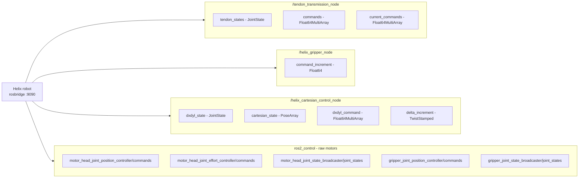

# Topics and Services

Complete inventory of the topics and services the Helix robot exposes over
rosbridge, and how to view them from this container. The content below is
based on the official
[`Topics_and_Services.md`](https://github.com/eai-ag/ros-helix/blob/main/Topics_and_Services.md)
from [`eai-ag/ros-helix`](https://github.com/eai-ag/ros-helix); the names
use the resolved absolute form (the official doc writes them relative to
each node namespace with `~/`).

> The definitive list for **your** robot is what `helix_info` prints -
> the robot may expose extra interfaces (e.g. the `/helix/*` ones used by
> `helix_control`) that are not covered by the official reference.

## Table of Contents

- [Interface Overview](#interface-overview)
- [Topics](#topics)
- [Services](#services)
- [Viewing Topics](#viewing-topics)
- [Viewing Services](#viewing-services)
- [References](#references)
- [Notes](#notes)

## Interface Overview

The robot exposes four interface groups: the arm tendon transmission, the
gripper, the cartesian model and the raw `ros2_control` motors. All topics
are bridged to native ROS 2 topics with the same names by `helix_bridge`:



## Topics

All topics below are bridged to native ROS 2 topics **with the same name**
by `helix_bridge`, so they appear in `ros2 topic list` and in PlotJuggler.

### Arm tendons - `/tendon_transmission_node`

Source: [`tendon_transmission.py`](https://github.com/eai-ag/ros-helix/blob/main/helix_transmission/helix_transmission/tendon_transmission.py)
in the `helix_transmission` package.

| Topic | Type | Description |
| --- | --- | --- |
| `/tendon_transmission_node/tendon_states` | `sensor_msgs/msg/JointState` | Position and velocity of the 9 arm tendons (9 values) |
| `/tendon_transmission_node/commands` | `std_msgs/msg/Float64MultiArray` | Arm tendon position setpoints in [m], relative to the calibrated 0 position |
| `/tendon_transmission_node/current_commands` | `std_msgs/msg/Float64MultiArray` | Arm tendon current commands in [mA] |

### Gripper - `/helix_gripper_node`

Source: [`helix_gripper.py`](https://github.com/eai-ag/ros-helix/blob/main/helix_gripper/helix_gripper/helix_gripper.py).

| Topic | Type | Description |
| --- | --- | --- |
| `/helix_gripper_node/command_increment` | `std_msgs/msg/Float64` | Gripper tendon command in [m], clipped to the configured limit |

### Cartesian model - `/helix_cartesian_control_node`

Source: `helix_cartesian_control_node.py` in the proprietary companion
stack, referenced by the official doc but not publicly available.

| Topic | Type | Description |
| --- | --- | --- |
| `/helix_cartesian_control_node/dxdyl_state` | `sensor_msgs/msg/JointState` | DxDyL state of the model `[Dx1, Dy1, L1, Dx2, Dy2, L2, Dx3, Dy3, L3]` |
| `/helix_cartesian_control_node/cartesian_state` | `geometry_msgs/msg/PoseArray` | FK poses of the 3 segment end frames (`seg1_end_link` ... `seg3_end_link`) plus the gripper TCP (`helix_tcp`), 4 poses total |
| `/helix_cartesian_control_node/dxdyl_command` | `std_msgs/msg/Float64MultiArray` | Direct DxDyL command, converted to tendon lengths |
| `/helix_cartesian_control_node/delta_increment` | `geometry_msgs/msg/TwistStamped` | Incremental Cartesian TCP command; rotations are applied around the static axes of the `frame_id` in the header (defaults to `origin`) |

### Raw motors - `ros2_control`

The topics below are the raw motor interface used by `ros2_control`.
Prefer the custom topics above for calibrated, transmission-aware values.

Source: [`controllers.yaml`](https://github.com/eai-ag/ros-helix/blob/main/helix_description/config/controllers.yaml)
and the URDF in the
[`helix_description`](https://github.com/eai-ag/ros-helix/tree/main/helix_description)
package; see also the [ros2_control docs](https://control.ros.org/).

| Topic | Type | Description |
| --- | --- | --- |
| `/motor_head_joint_position_controller/commands` | `std_msgs/msg/Float64MultiArray` | Arm tendon motor joint setpoints in [rad] (9 values) |
| `/motor_head_joint_effort_controller/commands` | `std_msgs/msg/Float64MultiArray` | Arm tendon motor currents in [mA] (9 values) |
| `/motor_head_joint_state_broadcaster/joint_states` | `sensor_msgs/msg/JointState` | Arm tendon motor joint position, velocity and current |
| `/gripper_joint_position_controller/commands` | `std_msgs/msg/Float64MultiArray` | Gripper tendon motor joint setpoints in [rad] (1 value) |
| `/gripper_joint_state_broadcaster/joint_states` | `sensor_msgs/msg/JointState` | Gripper tendon motor joint position, velocity and current |

### Other topics

| Topic | Type | Description |
| --- | --- | --- |
| `/joint_states` | `sensor_msgs/msg/JointState` | Bridged for backward compatibility; see the two `joint_state_broadcaster` topics for the per-controller values |

## Services

### Bridged as native ROS 2 services (type `std_srvs/Trigger`)

`helix_bridge` exposes these with the same names, so they work with
`ros2 service list` / `ros2 service call` inside the container.

| Service | Description |
| --- | --- |
| `/tendon_transmission_node/switch_to_current_control` | Switch all motor controllers to current mode (position commands ignored) |
| `/tendon_transmission_node/switch_to_position_control` | Switch all motor controllers to position mode (current commands ignored) |
| `/tendon_transmission_node/set_motor_offsets` | Write the current motor joint positions to the calibration offsets file (sets the tendon 0 point) |
| `/tendon_transmission_node/check_calibration` | Check the current tendon positions against the calibrated 0, offsetting by +/-2*pi radians if needed; run when the robot is in its calibrated state |
| `/helix_cartesian_control_node/reset_model` | Reset the model to the initial state and command tendons to zero/calibrated lengths |
| `/helix_cartesian_control_node/activate_joystick_control` | Connect `spacenav/twist` to `~/delta_increment` (teleoperation) |
| `/helix_cartesian_control_node/deactivate_joystick_control` | Disconnect `spacenav/twist` from `~/delta_increment` |

### Not bridged (proprietary types)

These use `helix_transmission_interfaces` service types, which are
proprietary and not installed in this container, so `helix_bridge` cannot
expose them natively. Call them with `helix_control` or `roslibpy`
instead (see [Viewing services](#viewing-services)).

| Service | Type | Description |
| --- | --- | --- |
| `/tendon_transmission_node/set_current` | `helix_transmission_interfaces/SetCurrent` | Set all arm tendon current commands to the given [mA] value |
| `/helix_cartesian_control_node/go_to_gripper_pose_vector` | `helix_transmission_interfaces/GoToGripperPoseVector` | Move the gripper to a point + direction goal |
| `/helix_cartesian_control_node/go_to_gripper_pose_quat` | `helix_transmission_interfaces/GoToGripperPoseQuat` | Move the gripper to a point + quaternion goal |
| `/helix_cartesian_control_node/go_to_gripper_pose_euler` | `helix_transmission_interfaces/GoToGripperPoseEuler` | Move the gripper to a point + Euler angle goal |

### Extra `/helix/*` interfaces used by `helix_control`

The robot's proprietary stack exposes additional interfaces that
`helix_control` uses but the official reference does not document. They
are listed here for completeness - see them live with `helix_info`:

- Topics: `/helix/command/cartesian` (`geometry_msgs/msg/Pose`),
  `/helix/command/configuration` and `/helix/command/tendon_lengths`
  (`control_msgs/msg/InterfaceValue`), `/helix/command/button`
  (`std_msgs/msg/ColorRGBA`)
- Services: `/helix/gripper/open`, `/helix/gripper/close`
  (`std_srvs/srv/Trigger`), `/helix/gripper/set_position`
  (`helix_interfaces/srv/SetFloat32`), `/helix/start_calibration`,
  `/helix/finish_calibration`, `/helix/calibrate_compression_limits`
  (`std_srvs/srv/Empty`)
- Parameters (via `get_parameters` / `set_parameters`):
  `/helix/tendon_calibration_node/calibration_current_ma`,
  `/helix/dynamixel_driver_node/motor_<id>/current_limit`

## Viewing Topics

### CLI

```bash
# Terminal 1 - start the bridge (all topics and services)
ros2 run helix_comm helix_bridge

# Terminal 2 - inspect the bridged topics
ros2 topic list
ros2 topic info /tendon_transmission_node/tendon_states -v
ros2 topic echo /tendon_transmission_node/tendon_states
```

Command topics (`.../commands`, `.../command_increment`, `.../dxdyl_command`,
`.../delta_increment`) only carry data while the robot is streaming
commands, e.g. while `helix_control` runs. State topics (`.../tendon_states`,
`.../cartesian_state`, the `joint_state_broadcaster` topics) publish
continuously.

### PlotJuggler

```bash
# Terminal 1
ros2 run helix_comm helix_bridge

# Terminal 2
plotjuggler
```

In PlotJuggler, add the ROS 2 data source
(**Add data -> ROS 2 Topic Subscriber**), select the topics you care about
from the list, then drag the curves you want onto a plot. Joint positions
and tendon lengths land under the `position` field of the respective
`JointState` topics, e.g. `tendon_states/position[0..8]`.

## Viewing Services

### Bridged services - ROS 2 CLI

```bash
ros2 service list
ros2 service type /tendon_transmission_node/check_calibration
ros2 service call /tendon_transmission_node/check_calibration std_srvs/srv/Trigger "{}"
```

### Robot-native services - `helix_control`

```bash
ros2 run helix_comm helix_control calibrate status
ros2 run helix_comm helix_control calibrate current 100     # set_current, [mA]
ros2 run helix_comm helix_control open                      # /helix/gripper/open
ros2 run helix_comm helix_control close                     # /helix/gripper/close
```

### Any service - `roslibpy`

```python
import roslibpy

client = roslibpy.Ros(host="<robot-ip>", port=9090)
client.run()

svc = roslibpy.Service(client, "/tendon_transmission_node/set_current",
                       "helix_transmission_interfaces/SetCurrent")
print(svc.call(roslibpy.ServiceRequest({"current": 100.0})))
```

## References

### Official Helix documentation (`eai-ag`)

- [`Topics_and_Services.md`](https://github.com/eai-ag/ros-helix/blob/main/Topics_and_Services.md) -
  the official reference this page is based on
- [Userguide 0 - Configuration](https://github.com/eai-ag/ros-helix/blob/main/Userguide_0_Configuration.md)
- [Userguide 1 - Calibration and basic control](https://github.com/eai-ag/ros-helix/blob/main/Userguide_1_Calibration_And_Basic_Control.md)
- [Userguide 2 - Cartesian control](https://github.com/eai-ag/ros-helix/blob/main/Userguide_2_Cartesian_Control.md)
- [Userguide 3 - External interfaces](https://github.com/eai-ag/ros-helix/blob/main/Userguide_3_External_Interfaces.md)
- [`helix_ros2_diagram.pdf`](https://github.com/eai-ag/ros-helix/blob/main/helix_ros2_diagram.pdf)
  ([`.drawio` source](https://github.com/eai-ag/ros-helix/blob/main/helix_ros2_diagram.drawio))
- [ros-helix README](https://github.com/eai-ag/ros-helix) - launching the
  embedded Helix ROS system and connecting to the Pi

### Interface source files

- [`tendon_transmission.py`](https://github.com/eai-ag/ros-helix/blob/main/helix_transmission/helix_transmission/tendon_transmission.py) -
  `/tendon_transmission_node`
- [`helix_gripper.py`](https://github.com/eai-ag/ros-helix/blob/main/helix_gripper/helix_gripper/helix_gripper.py) -
  `/helix_gripper_node`
- [`controllers.yaml`](https://github.com/eai-ag/ros-helix/blob/main/helix_description/config/controllers.yaml) -
  `ros2_control` controller configuration
- `helix_cartesian_control_node.py` - `/helix_cartesian_control_node`,
  in the proprietary companion stack (not public)

### Full stack and SDK

- [`eai-ag/main`](https://github.com/eai-ag/main) - docker-compose
  launcher for the whole robot stack; README covers launch and
  troubleshooting
- [`embodiedai-helix-sdk`](https://github.com/eai-ag/embodiedai-helix-sdk) -
  official Python SDK, no ROS required
- [`ros-rosbridge-suite`](https://github.com/eai-ag/ros-rosbridge-suite) -
  the rosbridge server on port 9090
- [`ros-foxglove-bridge`](https://github.com/eai-ag/ros-foxglove-bridge) -
  Foxglove WebSocket bridge, `ws://<pi-ip>:8765`

### Tooling documentation

- [`roslibpy`](https://roslibpy.readthedocs.io/) - Python rosbridge client
- [rosbridge protocol](https://github.com/RobotWebTools/rosbridge_suite) -
  rosbridge server and protocol spec (upstream)
- [PlotJuggler](https://plotjuggler.readthedocs.io/) - plotting GUI
- [Foxglove](https://docs.foxglove.dev/) - browser visualization
- [ros2_control](https://control.ros.org/) - raw motor controllers

See [docs/README.md](README.md) for the full reference map.

## Notes

- **Namespace resolution**: the official doc writes `~/commands` under
  `/tendon_transmission_node`; the resolved absolute name is
  `/tendon_transmission_node/commands`. All names here are absolute.
- **Raw vs. calibrated**: the `ros2_control` topics interface the motors
  directly, without transmission and limits - prefer the
  `tendon_transmission_node` / `helix_cartesian_control_node` topics for
  calibrated values, as recommended by the official reference.
- **Bridging custom services**: services with
  `helix_transmission_interfaces` types cannot be bridged because those
  interface packages are proprietary; this container only ships standard
  message and service definitions.
- **Unknown topics**: `helix_bridge` ignores robot topics that are not in
  its list, and silently tolerates subscribing to topics the robot does
  not publish (PlotJuggler simply shows no data for them). Add extra
  topics with `--topics ROS_TYPE:TOPIC_NAME`.
